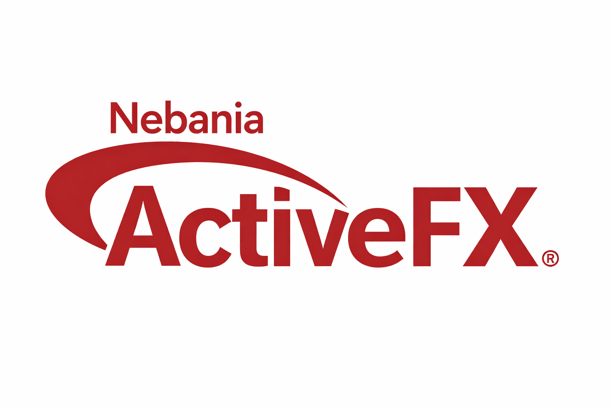

# Nebania ActiveFX

ActiveFX is runtime for the link(Script) programming language created by Pilot
<a href="https://github.com/Pilot0253/link-lang#">
Project's Page
</a>

ActiveFX Provides:
<ul>
    <li>LinkScript - a dailect of Link</li>
    <li>Shockwave - Official Player to run AFX Content under the adl/xml format</li>
</ul>

<h3>dependices</h3>
<ul>
<li>SDL2</li>
<li>SDL2_Image</li>
<li>pugixml</li>
</ul>

## How to build:

1:get the repository from github:
`git clone https://github.com/tohar777/Nebania-ActiveFX.git`

2.1:compile for emscripten

`make build_wasm'

2.2:compile of a standalone
`make build`